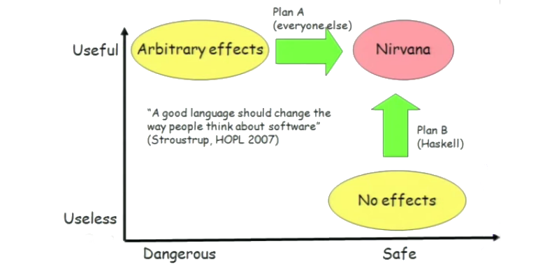

# ¿Por qué Haskell?

## ¿Por qué Haskell?

Haskell proveé:

* Código de alto nivel **mantenible**.
* Alto **desempeño**.
* Código **cross-platform**.
* Lenguaje **interpretado** o **compilado**.
* Paralelización *"gratuita"*.
* La mayoría de los **errores se detectan en tiempo de compilación**.
* Buenas herramientas de profiling y debug.
* Tiene **garbage collection**.

Pero principalmente:

* Haskell es un lenguaje que tiene varias características especiales y presenta un **enfoque diferente** ante los siguientes **problemas**...

## El problema de la seguridad



## El problema de la complejidad

* Parte de **saber programar** es saber **manejar la complejidad**, más aun en el software moderno.

* Parte de **programar en equipo** es **modularizar** y diseñar la **interfaz** de cada componente.

* Esto es determinar (e informar, o mejor aun, que sea obvio) el alcance de los **efectos** de nuetros componentes.

* Esto se evidencia mucho al diseñar **programas paralelos** y código **reusable** y **mantenible**.

## Plan A (todo el mundo)

* Los lenguajes convencionales parten de la idea de permitirle al programador hacer todo (*efectos arbitrarios*), por lo tanto son **útiles** pero **inseguros**.

* La **inseguridad** implica también que se deben realizar esfuerzos por manejar la **complejidad**, porque un programador no puede asumir cosas sobre el comportamiento del código.

### El plan

* **Añadir restricciones**: *scope*, *modulos*, el *typesystem*, etc.

* Se utilizan paradigmas y constructos del lenguaje, por ejemplo, **funciones**, **programación orientada a objetos** y **patrones de diseño**, pero su uso correcto siempre depende del programador.

## Plan B (Haskell)

*Se necesita ver algunos conceptos primero...*

## Haskell

Haskell es un lenguaje:

* **Puramente funcional**.
* Tiene **tipificado fuerte estático**, pero **inferencia de tipo**.
* Permite **programación genérica**.
* Tiene **evaluación no estricta**.
* Adicionalmente, usa **pattern matching**.

*Veamos qué significa cada una de estas cosa...*

# Programación puramente funcional

## Programación puramente funcional

* Haskell es un lenguaje de programación **puramente funcional**.

* La **programación funcional** es un tipo de **programación declarativa**.

* Hace amplio uso de la **recursión**.

## Programación declarativa

* Suele corresponderse con la **lógica matemática**.
* Uno **NO** le dice al computador **qué hacer** para obtener el resultado.
* Uno indica **qué es** el resultado, tal como se hace con una definición matemática.
* Las instrucciones se deducen a partir de las expresiones.
* Carece de **side effects** (cambios de estado fuera de la **ejecución** de la función).

### Pregunta

*¿Qué ventajas y desventajas tiene esto?*

## Ejemplos de recursión

```haskell
quicksort :: (Ord a) => [a] -> [a]  
quicksort [] = []  
quicksort (x:xs) =   
    let smallerSorted = quicksort [a | a <- xs, a <= x]  
        biggerSorted = quicksort [a | a <- xs, a > x]  
    in  smallerSorted ++ [x] ++ biggerSorted


maximum :: (Ord a) => [a] -> a
maximum [] = error "maximum of empty list"
maximum [x] = x
maximum (x:xs)
    | x > maxTail = x
    | otherwise = maxTail
    where maxTail = maximum' xs
```

## Transparencia referencial

* La **transparencia referencial** es un resultado de la ausencia de **side effects**, significa que al llamar una función con los mismos argumentos, siempre entregará el mismo resultado.

### Pregunta

*¿Las variables static implican side effects?*

## Transparencia referencial

* La ausencia de **side effects** nos permite utilizar una función abstrayéndonos del contexto de dicha función y su historial de usos para predecir su comportamiento.

* O como les gusta decír a la gente de Haskell, *saber que no disparará los misiles*.

### Pregunta

*¿Es posible que un programa esté 100% libre de side effects?*

## Programación funcional

* Una vez se define algo, jamás cambia de estado (**data inmutable**). Es decír, las *variables* no pueden cambiar.
* Trata la computación como la evaluación de **funciones matemáticas**.
* Tiene sus orígenes en el **cálculo lambda**.

## Data inmutable

+ Implica que como usuarios de funciones, ninguna de ellas modificará nuestras *variables* sino que nos entregará una *nueva* (siempre hay **paso por valor**).
+ Implícitamente, almacenar un valor es lo mismo que almacenar una referencia a dicho valor (porque ese valor no va a cambiar).
+ No se utilizan *punteros*.

### Pregunta

* *Si siempre hay paso por valor, ¿Siempre hay que copiar toda la estructura de datos?*

## Ventajas de la programación funcional

+ Las ventajas de la data inmutable.
+ Las funciones están completamente encapsuladas, por definición.
+ Asegura determinismo.
+ Simplifica programas paralelos.

# Tipificado fuerte estático

## Tipificado fuerte estático

+ **Tipificado estático** significa que el *type checking* ocurre en tiempo de compilación.
+ **Tipificado fuerte** significa que sólo podemos acceder a la data a través de su tipo (no, por ejemplo, a los bytes).
+ Las funciones están definidas para trabajar con ciertos tipos de datos y por lo tanto tienen un comportamiento **definido**.
+ Los errores relacionados con tipos de datos incorrectos se pueden detectar en **tiempo de compilación**.

# Programación genérica

## Programación genérica

* Las funciones programadas pueden funcionar para **más de un data type**.

* En Haskell podemos definir una misma función que opere con cualquiér **data type**, o cualquier **data type** que cumplan ciertas condiciones (tenga cierto comportamiento definido).

* Además, **las funciones son tipos de datos también** y son tratados como cualquier otro.

* Es fácil crear **funciones de orden superior** (funciones que reciben funciones).

## Ejemplo

Pensemos en un **sort**:

* En **C** (tipificado estático pero no fuerte) tenemos que usar punteros voids para lograr una función genérica:
    ```
    void qsort (void *ptr, size_t count, size_t size,
    int (*comp)(const void *, const void *));
    ```

* En **python** podemos tener objetos de tipos diferentes en nuestra lista, pero fallará en *runtime* si el operador de comparación no está definido para las clases de esos objetos.
    ```python
    sorted(iterable, key=None, reverse=False)
    ```

## Ejemplo

* **Haskell** aprovecha la programación genérica para tener un **sort** que funciona con cualquier tipo `a`, siempre que sea de la *clase* `Ord` (pues necesita que el operador de comparación esté definido para ese tipo), pero también podemos usar `sortBy` y usando nuestra propia función de comparación.
    ```
    sort :: Ord a => [a] -> [a]
    sortBy :: (a -> a -> Ordering) -> [a] -> [a]
    ```

# Non-strictness

## Non-strictness

* Los valores sólo se computan cuando se necesitan, ahorra mucha síntaxis.

* Se va juntando una serie de operaciones pendientes, un **thunk**.

* Permite tener estucturas **infinitas**, y **definciones cíclicas**.

* Puede mejorar implícitamente algoritmos, permitiendo ahorrar trabajo innecesario. Pero se requiere maestría.

### Pregunta

*¿Qué desventajas puede tener alguna desventaja la evaluación no estricta?*

## Un ejemplo con (quick)sort

Supongamos que `xs` es una lista con 500000 elementos.

```haskell
sum xs                  -- 0.16 ms
sum (take 50 xs)        -- 0.00 ms
sum (sort xs)           -- 2.32 ms
sum (take 50 (sort xs)) -- 0.31 ms
```

Se puede ahorrar trabajo incluso en funciones que no conocemos.

## Un ejemplo de estructuras de datos infinitas

```haskell
-- Lista infinita de naturales:
nums = [1..]

-- Lista infinita de números divisibles por 3:
nums3 = [0,3..]
nums3 = filter (\n -> mod n 3 == 0) [0..]

-- Lista con los números de fibonacci:
fibs = 0 : 1 : zipWith (+) fibs (tail fibs)
```

# Pattern matching

## Pattern matching

Una misma función se puede definir para inputs que calzan con diferentes **patrones**:

```haskell
take :: Int -> [a] -> [a]
take 0 _  =  []
take _ [] =  []
take n (x:xs) =  x : take (n-1) xs

subconjuntos :: [a] -> [[a]]
subconjuntos [] = [[]]
subconjuntos (x:xs) = [x:ys | ys <- sub] ++ sub
    where sub = subconjuntos xs
```

También se puede aprovechar esto en **case expressions**.

# Plan B (Haskell)

## Plan B (Haskell)

* Haskell se basa en modelo computacional del **cálculo lambda**, que inicialmente es restrictivo (*ausencia de efectos*), de hecho "*inútil*".

* Para que sea útil, los **side effects**, cuando son necesarios, se manejan usando el *typesystem*.

* El *typesystem* se encarga de que el código *puro* no se "contamine" con el *impuro* (**efectos controlados**).

* La **programación funcional** facilita la **modularidad** y la **escalabilidad**.

* La **reusabilidad** se logra mediante la **programación genérica**.

## Ejemplos

```haskell
-- Función pura:
raices :: (Floating t, Ord t) => t -> t -> t -> [t]
raices a b c = let
    d = b^2-4*a*c
    e = sqrt d
    in if d >= 0 then [(-b+e)/(2*a), (-b-e)/(2*a)]
    else error "No tine raices reales"

-- Función impura:
countLines :: FilePath -> IO Int
countLines fname = do
    contents <- readFile fname
    putStr contents
    let lins = lines contents
    return (length lins)
```

## Experiencia personal

+ El programador debe pensar más para resolver los problemas, pero las soluciones resultan **robustas**.
+ Usualmente el código es compacto y puede resultar poco legible, pero es completamente **modular**.
+ En proyectos grandes, parte importante del trabajo es definir las **estructuras de datos** que se utilizarán y hasta qué nivel **generalizar** el código.
+ El **tipificado fuerte** y **estático** de Haskell, junto con la programación funcional, atrapa la mayor parte de los errores en tiempo de compilación.
+ La ausencia de **side effects** permite un código más seguro.
+ El **sistema de tipos** de Haskell permite realizar **programación genérica**, siendo una herramienta muy poderosa.
+ Generalmente es posible optimizar Haskell a una velocidad comparable a la de C (depende mucho de la programación).

## Experiencia personal

- La **laziness** complica conocer la complejidad real de los programas y la comunicación entre threads y es fuente de *sorpresas desagradables*, relacionadas con el uso de memoria. Esto se puede evitar con **evaluación estricta**.
- El concepto de ``**monad**'', usado por muchas soluciones de Haskell, es difícil de entender, pero se puede evitar o usar superficialmente.
- Aunque la comunidad es amigable, está más relacionada con la academia, las librerías son limitadas.

## Videos extra

* [**Haskell is useless**](https://www.youtube.com/watch?v=iSmkqocn0oQ)

* [Lambda Calculus - Computerphile](https://www.youtube.com/watch?v=eis11j_iGMs)
