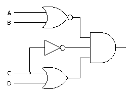

## Hola mundo

1. Crear un archivo `hola_mundo.hs` y escribir:

    ```haskell
    main = do
        print "Hola mundo"
    ```

2. Podemos abrir `ghci` y cargar el archivo `hola_mundo.hs`:

    ```bash
    $ ghci
    GHCi, version 7.10.3: http://www.haskell.org/ghc/
    Prelude> :l hola_mundo.hs
    [1 of 1] Compiling Main ( hola_mundo.hs, interpreted )
    Ok, modules loaded: Main.
    ```

3. Y ejecutar la función `main`:

    ```bash
    *Main> main
    "Hola mundo"
    ```

## Compilar

También es posible compilar el programa con `ghc`:

```bash
$ ghc hola_mundo.hs
[1 of 1] Compiling Main ( hola_mundo.hs, hola_mundo.o )
Linking hola_mundo ...
$ ./hola_mundo
"Hola mundo"
```

La función `main` siempre será la entrada al programa y siempre es **impura**, específicamente del tipo `IO ()`, y por eso se utiliza la notación `do`.

## Introducción a la notación `do`

La notación `do` es una *syntax sugar* para **monads**, `IO` es una **monad** que representa los *contextos computacionales* en que se pueden realizar cambios (o recibir información) desde el mundo exterior.

Ambos conceptos están fuera de alcance, así que, por ahora, es recomendable simplemente acostumbrarse a utilizarlo, más que saber su justificación.

Se puede pensar que `do` indica una serie de operaciones **secuenciales** que pueden hacer más cosas que meramente entregar un resultado.

## Introducción a la notación `do`

Si hay funciones que obtienen un valor desde fuera, por ejemplo:
```
readFile :: FilePath -> IO String
```
(Que por ser `IO String` sabemos que obtendrá una `String` desde fuera del programa).
Podemos usar el operador `<-` para asociar el resultado a una *variable*.

```haskell
countLines :: FilePath -> IO Int
countLines fname = do
    contents <- readFile fname
    putStr contents
    let lins = lines contents
    return (length lins)
```

Lo último será lo que se "retorna", pero tiene que ser `IO`, `return` crea un `IO` a partir de un valor que no lo es.

## Ejercicio

Hacer un programa que pregunte por un nombre y lo imprima en pantalla.

Puede utilizar:

```haskell

getLine :: IO String

print :: Show a => a -> IO ()

putStr :: String -> IO ()


```

A continuación se dejará de trabajar con `IO` pues se verá la siguiente clase. Era necesario saber lo básico porque la entrada del programa, la función `main`, siempre será `IO ()`.

## Comandos ghci

Podemos ver los comandos si escribimos `:help` o `:h`.

Los más útiles suelen ser `:l <file>` para cargar un archivo, `:r` para recargarlo, `:t` para ver el tipo (firma) de una *función* o de una *variable*, `:k` para ver el *kind* de un tipo, `:i` para obtener información de un tipo o una *typeclass*.

## Expresiones condicionales

Haskell tiene varias formas de hacer condiciones:

```haskell
-- Usando if..then..else
signo :: Int -> Int
signo i = if (i==0) then 0 else (if i<0 then -1 else 1)

-- Usando guards
signo :: Int -> Int
signo i
    | i == 0    = 0
    | i < 0     = -1
    | otherwise = 1
```

## Pattern matching

```haskell
-- Usando pattern matching
nombrar :: [String] -> String
nombrar []     = "Nadie."
nombrar [a]    = a ++ "."
nombrar [a,b]  = a ++ " y " ++ b ++ "."
nombrar (a:as) = a ++ ", " ++ nombrar as

-- Usando case expressions
nombrar :: [String] -> String
nombrar li = case li of
    []     -> "Nadie."
    [a]    -> a ++ "."
    [a,b]  -> a ++ " y " ++ b ++ "."
    (a:as) -> a ++ ", " ++ nombrar as
```

## Ranges

Son una forma de crear listas con un cierto step.

* Para hacer un range:
    ```
    [<1er elem>..<ultimo elem>]
    ```
* Para hacer un range infinito:
    ```
    [<1er elem>..]
    ```
* Con step:
    ```
    [<1er elem>,<2do elem>..<ultimo elem>]
    ```

## Ranges

Se pueden hacer con cualquier **tipo** de la clase **Enum**:

```haskell
ghci> [1..10]
[1,2,3,4,5,6,7,8,9,10]  
ghci> ['a'..'z']  
"abcdefghijklmnopqrstuvwxyz"
```

### ADVERTENCIA
Los ranges tienen un comportamiento extraño con **Floats**. Ver lo que pasa con:
``` haskell
ghci> [0.1, 0.3 .. 1]
[0.1,0.3,0.5,0.7,0.89999999999999,1.09999999999999]
```

## List comprehensions

Listas que se declaran de la siguiente forma:
```
[ <funcion de x> | x <- <lista> , <condicion> ]
```

Se puede hacer con cuantas variables se quiera y se suele usar con ranges.

### Ejemplo:

```haskell
-- Todos los trios pitagóricos:
rTriangs :: [(Integer,Integer,Integer)]
rTriangs = [ (a,b,c) | c <- [1..],
                       b <- [1..c],
                       a <- [1..b], a^2 + b^2 == c^2]
```

<!-- @@@@@@@@@@@@@@@@@ -->
## Tipos de datos

El **typesystem** de Haskell tiene:

1. **Types**: Son tipos de datos (`Bool`,`Int`,`Char`,`[Int]`,`(Char,Int)`, etc.).
2. **Typeclasses**: Son *interfaces* para tipos de datos, permiten que se pueda utilizar una misma función con todos los tipos que son instancias de esta *interfaz*.

    Por ejemplo, para que un tipo `a` sea de la typeclass `Eq` tiene que tener definido los operadores:
    ```haskell
    Prelude> :t (==)
    (==) :: Eq a => a -> a -> Bool
    Prelude> :t (/=)
    (/=) :: Eq a => a -> a -> Bool
    ```

3. **Type synonyms**: Son sinónimos para ciertos tipos, equivalente a un **typedef** en C. `String` es un ejemplo (en realidad es un sinónimo para `[Char]`).

## Tipos incompletos

Los tipos que están completamente definidos como `Int`,`Bool` o `Char` son **tipos concretos**.

Los tipos que requieren otros tipos para estar completamente definidos, como `[a]` (listas), `(a,b)`, `(a,b,c)`, etc. Son **tipos incompletos**.

Los **tipos incompletos** también pueden ser instancias de **typeclasses**, por ejemplo, `[a]` es `Eq` y `Ord`, siempre que `a` sea `Eq` y `Ord`.

## Tipos

### ()
El más simple de todos los tipos, enumeración con sólo valor posible: `()`.

### Bool
Enumeración con dos valores posibles: `True` y `False`. [Documentación](http://hackage.haskell.org/package/base-4.9.1.0/docs/Data-Bool.html)

### Ordering
Enumeración que puede tener 3 posibles valores como resultado de una comparación (`LT`,`GT` o `EQ`)

## Tipos

### Char
Enumeración cuyos valores representan los caracteres Unicode. [Documentación](http://hackage.haskell.org/package/base-4.9.1.0/docs/Data-Char.html).

### String
Es un *type synonym* de `[Char]`, sin embargo, tiene varias funciones exclusivas. [Documentación](https://hackage.haskell.org/package/base-4.9.0.0/docs/Data-String.html)

## Tipos

### Int
Número entero `Bounded` (*limitado*), dependiendo de la cantidad de bits del procesador. [Documentación](https://hackage.haskell.org/package/base-4.7.0.1/docs/Data-Int.html).

### Integer
Número entero que puede ser infinitamente grande. [Documentación](http://hackage.haskell.org/package/base-4.9.1.0/docs/Prelude.html#t:Integer)

### Float y Double
Números de coma flotante de precisión simple y doble. [Documentación](https://hackage.haskell.org/package/base-4.7.0.1/docs/Prelude.html#t:Float)

## Tipos incompletos

### [a]
Listas, funcionan como listas enlazadas. [Documentación](https://hackage.haskell.org/package/base-4.9.0.0/docs/Data-List.html)

### Tuples (a,b) (a,b,c) (a,b,c,d) ...

Son muy útiles para cuando una función debe entregar más de un valor y para agrupar variables semejantes ya que las tuplas son instancias de varias *typeclasses*, generalmente heredando el comportamiento de los tipos que las componen. [Documentación](http://hackage.haskell.org/package/base-4.9.1.0/docs/Prelude.html#g:3)

Tuplas `(a,b)` cuentan con las funciones `fst` y `snd`, para extraer los valores que almacenan en el resto hay que usar *pattern matching* en **bindings**.

## Tipos incompletos

### Maybe a

Cosas que pueden ser `Just a` o `Nothing`, `Nothing` se suele usar para casos en que no tiene sentido que la función entregue en valor del tipo `a`. [Documentación](http://hackage.haskell.org/package/base-4.9.0.0/docs/Data-Maybe.html)

### Either a b

Cosas que pueden ser del tipo `Left a` o `Right b`, generalmente `b` se utiliza para códigos de error o excepciones. [Documentación](http://hackage.haskell.org/package/base-4.6.0.1/docs/Data-Either.html)

## Tipos incompletos

### Set

Conjuntos que se almacenan como árboles binarios balanceados, suelen ser una buena opción cuando se necesita complejidad de acceso y modificación $log(n)$. [Documentación](http://hackage.haskell.org/package/containers-0.5.9.1/docs/Data-Set.html)

### Otros

Existen
[**Matrix**](http://hackage.haskell.org/package/matrix-0.2.1/docs/Data-Matrix.html), [**Ratio**](http://hackage.haskell.org/package/base-4.9.1.0/docs/Data-Ratio.html#t:Ratio),
[**FingerTree**](http://hackage.haskell.org/package/fingertree-0.1.1.0/docs/Data-FingerTree.html),
[**Array**](https://hackage.haskell.org/package/array-0.5.1.1/docs/Data-Array.html) y muchos más.

## Import

Para acceder a todas las funciones de estos **tipos** en la mayoría de los casos será necesario hacer un:
```haskell
import Data.<tipo>
```
o, para evitar colisiones de nombres:
```haskell
import qualified Data.<tipo> as <abreviación>
```

<!-- @@@@@@@@@@@@@@@@@ -->
## Typeclasses

Se puede ver qué tipos están instanciados en una typeclass usando `:i <typeclass>`, de la misma manera, para ver que instancias tiene un tipo `:i <tipo>`.

### Num

Incluye todos los números, incluídos punto flotante. Tiene funciones como `*`,`+`,`-`.

### Integral

Incluye todos los números enteros. Tiene funciones como `mod`.

## Typeclasses

### Eq

Tipos en los que se puede comprobar la igualdad. Tienen las funciones `==` y `/=`

### Ord

Tipos que se puede comparar y ordenar, deben ser `Eq` para ser `Ord`. Tienen las funciones `>`,`>=`, `<`, `>` y `compare`.

## Typeclasses

### Show

Tipos que tienen definida una función `show` que los transforma a `String`.

### Read

Tipos que tienen definida una función `read` que permite *parsearlos* desde una `String`.

## Typeclasses

### Enum

Tipos que tienen sus valores secuencialmente ordenados. Tiene funciones como `succ` y `pred`.

### Bounded

Clases que tienen límites definidos, tienen las "variables" `minBound` y `maxBound`.

## Typeclasses

### Fractional

Números que pueden representar fracciones, tienen funciones como `/`.

### Typeclases para tipos incompletos

Por ejemplo: **Functor**, **Foldable**, **Monoid** y **Monad**.

<!-- @@@@@@@@@@@@@@@@@ -->
## Bindings

Se usan para evitar tener que escribir algo varias veces, es decir, asociar un valor a una "variable".

Los bindings no se ejecutan en un orden específico, son simultáneos y por lo tanto permiten *estructuras ciclicas*.

## Binding let..in..

```haskell
mean :: [Float] -> Float
mean xs = let
    suma = sum xs
    cant = length xs
    in suma / fromIntegral cant
```

También pueden ser paramétricos o usar pattern matching.

```haskell
hipoten :: Float -> Float -> Float
hipoten x y = let sq i = i*i in sqrt (sq x + sq y)
```

## Binding en list comprehensions

```haskell
calcImc :: [(Float, Float)] -> [Float]  
calcImc xs = [imc | (w, h) <- xs, let imc = w / h ^ 2]  
```

## Binding where

```haskell
describirLista :: [a] -> String  
describirLista xs = "La lista es " ++ what xs  
    where what [] = "vacía."
          what [x] = "un singleton."
          what xs = "larga."  
```

Tiene más sentido utilizarlo junto con guards.

```haskell
tellImc :: Float -> Float -> String  
tellImc peso altura  
    | imc <= 18.5 = "Flaco."
    | imc <= 25.0 = "Normal."
    | imc <= 30.0 = "Gordo."
    | otherwise   = "Obseso."
    where
    imc = peso / altura ^ 2
```

## Firmas de funciones

La firma de una función es opcional, pero es muy buena práctica colocarlas siempre, porque se pueden encontrar errores.

Aun así, es común no ponerla y ver la firma que `ghci` infiere pues será la más general posible.

```haskell
-- Firma normal
lines :: String -> [String]
-- Firma generalizada
reverse :: [a] -> [a]
-- Firma que requiere funciones
sortBy :: (a -> a -> Ordering) -> [a] -> [a]
-- Firma generalizada que requiere instanciación.
elem :: (Eq a, Foldable t) => a -> t a -> Bool
```

<!-- @@@@@@@@@@@@@@@@@ -->
## Listas

Las listas funcionan como listas enlazadas, y en términos de complejidad debemos pensar en ellas como pilas, en que la parte más accesible está al frente y la más "innacesible" está al fondo.

### Operador cons (:)

Añade un elemento al frente de una lista, también se puede usar para **pattern matching**.
```haskell
pairs :: [a] -> [(a,a)]
pairs []         = []
pairs (a:b:rest) = (a,b) : pairs rest
```

### Operador ++

Concadena dos listas, tiene complejidad igual al tamaño de la lista izquierda.

## Listas

### Operador !!

Accede a una posición en particular de una lista, tiene complejidad igual a dicha posición.

### null

Vale `True` si la lista es vacía o `False` si no lo es.

### head, tail, last, init

Separan la lista, `head` obtiene el primer elemento, `tail` obtiene una lista con los elementos restantes. `last` y `init` son equivalentes pero es el último elemento el que se toma (por lo mismo tienen complejidad igual al largo de la lista).

### take, drop

`take n lista` obtiene los primeros `n` elementos de `lista`, mientra que `drop n lista` obtiene la lista descontando los primeros `n` elementos.

## Listas

### reverse

Invierte una lista.

### maximum, minimum

El mayor o menor elemento de una lista.

### product, sum

Productoria y sumatoria de una lista.

### elem

`elem a lista` vale `True` si `a` está en la `lista` o `False` si no es así.

## Listas

### cycle

Infinitas concatenaciones de la lista.

### repeat

Crea una lista que contiene un mismo elemento infinitas veces.

### replicate

`replicate n e` crea una lita que contiene un mismo elemento `e`, `n` veces.

<!-- @@@@@@@@@@@@@@@@@ -->
## Programación funcional

Para poder programar funcionalmente tenemos que tener en cuenta:

* Nunca vamos a *modificar* algo, si necesitamos cambiar una sola celda en una matriz, usaremos una función que a partir de la matriz, nos entregará otra con el valor modificado.

* Debemos pensar en las funciones como **circuítos lógicos**, entra algo y sale algo diferente, no cambia el estado del componente ni nada fuera de él.

* El único efecto que puede tener nuestras funciones está en el valor de **retorno**, y se puede escribir con una sola expresión (aunque podemos usar *alias*).

* Generalmente en vez de usar **iteración** se usa **recursión** y en vez de **variables**, **argumentos** de funciones adicionales.

## Circuito



<!-- @@@@@@@@@@@@@@@@@ -->
## Lambda

Las funciones lambda tienen la forma:

```haskell
(\ <arg1>,<arg2>,... -> <resultado>)
```

Suelen ser muy útiles para funciones como **folds** o **maps**.

## Map

`map` ejecuta una función sobre cada elemento de una lista y retorna una lista con los resultados de dichas funciones.

```haskell
map :: (a -> b) -> [a] -> [b]
```

```haskell
ghci> map length ["Hola","como","estás"]
[4,4,5]
```

## Folds

Son la forma de facto de iterar sobre una lista, a partir de modificar un valor inicial:

```haskell
foldl :: Foldable t => (b -> a -> b) -> b -> t a -> b
foldr :: Foldable t => (a -> b -> b) -> b -> t a -> b
```

Supongase que se tiene la lista `list` $=[x_0,x_1,x_2,x_3]$ un valor inicial para un "acumulador" `ini` y una función $f$ que recibe el estado actual del "acumulador" y un valor de la lista `list`. Un `foldl` equivaldría a:

```haskell
foldl f ini [x0,x1,x2,x3]
```

$$
= f(f(f(f(ini,x_0),x_1),x_2),x_3)
$$

## Ejercicio

Suponga que va a haber un baile en parejas. Implemente una función que reciba una lista de tuplas `(String,Bool)` que indican el nombre y género de cada invitado (mujeres `True` y hombres `False`) y retorne una lista de `(String,String)` con los nombres del hombre y la mujer de una posible pareja.

Si hay más personas de un género que del otro, las restantes bailarán con `"NADIE"`.

## Solución

Una de las tantas formas de lograrlo:

```haskell
baile :: [(String,Bool)] -> [(String,String)]
baile ps = let
    hombres = [nombre | (nombre,mujer) <- ps, not mujer]
    mujeres = [nombre | (nombre,mujer) <- ps, mujer]
    parejas [] []         = []
    parejas (h:hs) []     = (h,"NADIE") : parejas hs []
    parejas [] (m:ms)     = ("NADIE",m) : parejas [] ms
    parejas (h:hs) (m:ms) = (h,m) : parejas hs ms
    in parejas hombres mujeres
```

## Lectura adicional

* [Learn You a Haskell for Great Good! - Starting Out](http://learnyouahaskell.com/starting-out#ready-set-go)

* [Learn You a Haskell for Great Good! - Types and Typeclasses](http://learnyouahaskell.com/types-and-typeclasses)
