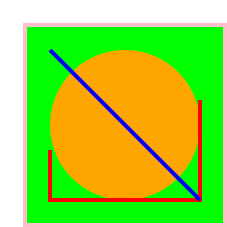

# Input/Output

## Repaso de IO

* Las funciones que tienen permiso para realizar cambios afuera del programa, como escribir por terminal, o leer input dle usuario son del tipo `IO x`.

* Donde `x` es el tipo de dato que "retornan".

* Cuando no retornan nada, `x` se reemplaza por `()`.

## Repaso de IO

* Obtener ese `x` que retorna un `IO` requiere **ejecutar** la acción.

* Sólo se puede **ejecutar** la acción en el contexto de otra función que retorna `IO x`, cuando
esta se ejecuta.

* Esto separa las funciones **impuras** de las **puras**.

* Por lo mismo, `main` es una función del tipo `main :: IO ()` y, es la que se **ejecuta** en un programa real.

## Más sobre notación do

La notación `do` permite construír un `IO x` a partir de otros `IO y` (y en realidad sirve para cualquier otra instancia de la *typeclass* `Monad`).

Es por eso que sólo se tiene el operador `<-` en la notación `do`. Este operador permite obtener el valor del tipo `x` en `IO x`, porque requiere **ejecutar** la acción.

```haskell
main :: IO ()
main = do  
    putStrLn "Cómo te llamas?"
    name <- getLine
    putStrLn ("Tu puedes " ++ name ++ "!")
```

## Más sobre notación do

En la notación `do`, lo que "retorna" la última expresión es lo que retorna el bloque en general.

```haskell
preguntarEdad :: String -> IO String
preguntarEdad nombre = do
    putStrLn ("Dame tu edad " ++ nombre)
    getLine
```

## Más sobre notación do

Por lo mismo, si se busca retornar algo que no es `IO`, se está **obligado** a usar `return` para promoverlo a `IO`.

```haskell
obtenerIMC :: IO Float
obtenerIMC = do
    putStrLn "Dame tu masa [kg]"
    peso <- getLine
    putStrLn "Dame tu altura [m]"
    altu <- getLine
    let imc = (read peso)/(read altu)^2
    return imc
```

## Más sobre notación do

La firma de `return` es:

```haskell
return :: Monad m => a -> m a
```

* **Nota**: `return` no es como en la mayoría de los lenguajes que *detiene* la ejecución de la función, sólo sirve para *promover* un `x` a `IO x`, en particular esa `IO x` no hace nada si se ejecuta, a parte de entregar el valor el tipo `x`.

## Más sobre notación do

Si queremos hacer condiciones podemos usar un `if ... else ...`

```haskell
retar :: IO ()
retar = do
    putStrLn "Dame tu edad"
    edad <- getLine
    if read edad < 12 then
        putStrLn "¡No deberías estar aquí!"
    else
        return ()
```

## Más sobre notación do

Aun si no se quiere hacer nada, hay que colocar el `return ()`.

Para evitarlo, se puede usar `when`:

```haskell
import Control.Monad (when)

retar' :: IO ()
retar' = do
    putStrLn "Dame tu edad"
    edad <- getLine
    when (read edad < 8) (putStrLn "No deberías estar aquí!")
```

## Más sobre notación do

Notar que si hubiera más de una acción `IO` será necesario crear otro bloque `do`:

```haskell
aceptarPorEdad :: IO Bool
aceptarPorEdad = do
    putStrLn "Dame tu edad"
    edad <- getLine
    if (read edad < 8) then do
        putStrLn "No deberías estar aquí!"
        return False
    else do
        putStrLn "Bienvenido a la dip wep!"
        return True
```

## mapM

Si se quiere realizar varias IO con argumetos diferentes, se puede utilizar `mapM`:

```haskell
mapM :: (Monad m, Traversable t) =>
        (a -> m b) -> t a -> m (t b)

preguntarEdades :: [String] -> IO [Int]
preguntarEdades names =
    let preguntar name = do
        putStrLn ("Qué edad tiene "++name++"?")
        edad <- getLine
        return (read edad)
    in mapM preguntar names
```

## mapM

```haskell
> mapM (\a -> putStrLn ("Hola" ++ a)) ["Zim","Gir","Dib"]
HolaZim
HolaGir
HolaDib
[(),(),()]
```

## mapM_

`mapM_` es igual pero descarta los resultados, en vez de entregar una lista con los mismos:

```haskell
mapM_ :: (Monad m, Foldable t) => (a -> m b) -> t a -> m ()

> mapM_ (\a -> putStrLn ("Hola" ++ a)) ["Zim","Gir","Dib"]
HolaZim
HolaGir
HolaDib
```

## Otras funciones interesantes:

```haskell
sequence :: (Monad m, Traversable t) => t (m a) -> m (t a)
-- | En Control.Monad :
forever :: Monad m => m a -> m b
forM :: (Monad m, Traversable t) =>
        t a -> (a -> m b) -> m (t b)
```

## Funciones para entrada y salida

```haskell
-- Entrada
getLine :: IO String
getChar :: IO Char
getContents :: IO String -- Lazy IO
-- Salida
putStrLn :: String -> IO ()
putStr :: String -> IO ()
putChar :: Char -> IO ()
print :: Show a => a -> IO ()
```

## interact

La función `interact` aprovecha la lazyness para recibir todo el input de usuario, incluso el futuro, como una sóla `String` (que se termina con un `EOF`) e imprime una `String`:

```haskell
interact :: (String -> String) -> IO ()
```

Un programa que revierte todas las líneas:

```haskell
transform :: String -> String
transform input = let
    lins = lines input
    lins' = map reverse lins
    in concat (map (++"\n") lins')

main = interact transform
```

## interact

Se pude probar con archivos:
```bash
ghc test.hs -o test.exe
cat archivo.txt | test.exe
```

O con `stdin`:
```bash
ghc test.hs -o test.exe
./test.exe
```

## Lectura de archivos

* Para obtener un `handle` de un archivo se puede utilizar `openFile`:

    ```haskell
    import System.IO
    openFile :: FilePath -> IOMode -> IO Handle
    ```
    Donde `IOMode` puede ser `ReadMode`,`WriteMode`,`AppendMode` o `ReadWriteMode`.

* Para cerrar el `handle` se utiliza `hClose`:

    ```haskell
    hClose :: Handle -> IO ()
    ```


## Lectura de archivos

* Para obtener los contenidos del `handle` se puede utilizar `hGetContents`, `hGetChar` o `hGetLine`.

    ```haskell
    hGetContents :: Handle -> IO String
    ```

```haskell
import System.IO

main = do  
    handle <- openFile "filename.txt" ReadMode
    contents <- hGetContents handle
    putStr contents
    hClose handle
```

## Escritura de archivos y demases

* Para escribir en un archivo se puede utilizar `hPutChar`, `hPutStr` y `hPutStrLn`.

    ```haskell
    hPutChar :: Handle -> Char -> IO ()
    hPutStr :: Handle -> String -> IO ()
    hPutStrLn :: Handle -> String -> IO ()
    ```

* Se puede utilizar `readFile`, `writeFile` y `appendFile` para leer o escribir todo en el archivo como una `String`, en una sola línea (`appendFile` agrega cosas al archivo sin borrarlo).

* Las funciones de lectura aprovechan la `lazyness`, así que no cargan todo el archivo en memoria al mismo tiempo.

## Argumentos de la línea de comandos

Para obtener los argumentos dados en la línea de comandos podemos utilizar `getArgs` y para obtener el nombre del ejecutable que se llamó, `getProgName`.

```haskell
import System.Environment
getArgs :: IO [String]
getProgName :: IO String
```

# Actividad

## Gráficos SVG

El siguiente es un ejemplo de gráficos SVG:

```xml
<?xml version="1.0" encoding="UTF-8" ?>
<svg xmlns="http://www.w3.org/2000/svg" version="1.1">
  <rect x="25" y="25" width="200" height="200"
    fill="lime" stroke-width="4" stroke="pink" />
  <circle cx="125" cy="125" r="75"
    fill="orange" />
  <polyline points="50,150 50,200 200,200 200,100"
    stroke="red" stroke-width="4" fill="none" />
  <line x1="50" y1="50" x2="200" y2="200"
    stroke="blue" stroke-width="4" />
</svg>
```
## Gráficos SVG


## Alfombra de Sierpinski

Es un fractal que se dibuja de la siguiente manera:

1. Se comienza con un cuadrado.
2. El cuadrado se corta en 3x3 cuadrados congruentes, y se dibuja el cuadrado central.
3. El paso anterior vuelve a aplicarse recursivamente a cada uno de los 8 cuadrados restantes.


## Actividad

Realizar un programa que lea un archivo con colores:
```
red
orange
red
blue
```
* Cree una imagen SVG con una Alfombra de Sierpinski con tantos pasos como líneas tiene el archivo.
* Que pinte los cuadrados creados en cada paso del color correspondiente.
* Que los cuadrados dibujados en el úlimo paso tengan tamaño $1\times 1$.
* **Opcional:** Que la ruta del archivo con colores y la imagen resultante sean parámetros de la línea de comandos.
