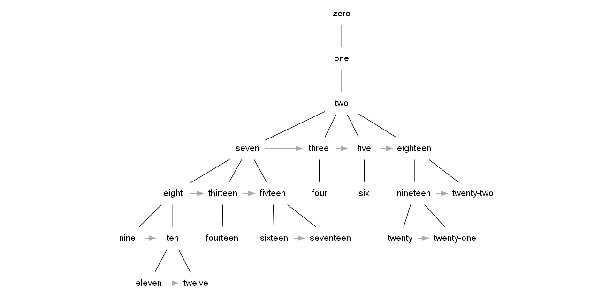

# Data.Map

## Listas de asociación

Las listas de asociación almacenan pares llave-valor sin un orden específico (osea funcionan como un diccionario), esto se puede hacer con una lista de pares:

```haskell
phoneBook = [
    ("Miller","555-2938"),
    ("Smith","452-2928"),
    ("Jackson","493-2928"),
    ("Bush","205-2928"),
    ("Crowell","939-8282"),
    ("Payne","853-2492")]
```

## findKey

### Ejercicio

Implementar la función `findKey` que busque el valor asociado a una llave, retornando `Just <valor>` o `Nothing` si no existe.

```haskell
findKey :: Eq a => a -> [(a, b)] -> Maybe b
```

## SOLUCIÓN: findKey

```haskell
findKey :: (Eq k) => k -> [(k,v)] -> Maybe v  
findKey key [] = Nothing  
findKey key ((k,v):xs) =
    if k == key then Just v else findKey key xs
```

Esta función viene en el preámbulo, con el nombre de `lookup`.

## Data.Map

`Map` es un datatype que ofrece la funcionalidad de un diccionario almacenando internamente un árbol con las llaves.

```haskell
import qualified Data.Map as M
```

Se puede utilizar `M.fromList` para crear un nuevo `Map` a partir de una lista de asociación:

```haskell
> M.fromList [(1,2),(3,4),(3,2),(5,5)]
fromList [(1,2),(3,2),(5,5)]  
```

## Data.Map

```haskell
M.empty :: M.Map k a
-- El Map vacío.

M.insert :: Ord k => k -> a -> M.Map k a -> M.Map k a
-- Inserta un par llave-valor al Map.

M.delete :: Ord k => k -> M.Map k a -> M.Map k a
-- Elimina el par con la llave indicada.

M.null :: M.Map k a -> Bool
-- Combrueba si el Map es vacío.

M.size :: M.Map k a -> Int
-- Entrega el tamaño del Mapa.
```

## Data.Map

```haskell
M.singleton :: k -> a -> M.Map k a
-- Crea un Map con un sólo par llave-valor.

M.lookup :: Ord k => k -> M.Map k a -> Maybe a
-- Entrega el valor asociado a una llave.

M.member :: Ord k => k -> M.Map k a -> Bool
-- Indica si la llave está presente.

M.map :: (a -> b) -> M.Map k a -> M.Map k b
-- Map sobre los valores.
```

## Data.Map

```haskell
M.filter :: (a -> Bool) -> M.Map k a -> M.Map k a
-- Filter sobre los valores.

M.toList :: M.Map k a -> [(k, a)]
-- Crea una lista de asociación del Map.

M.keys :: M.Map k a -> [k]
-- Entrega una lista con las llaves.

M.elems :: M.Map k a -> [a]
-- Entrega unalista con los valores.
```

# Data.Set

## Data.Set

`Set` permite trabajar con conjuntos, también se almacena internamente como un árbol.

```haskell
import qualified Data.Set as S
```

Se puede utilizar `S.fromList` para crear un nuevo `Set` a partir de una lista:

```haskell
> S.fromList [1,2,3,4,2]
fromList [1,2,3,4]
```

## Data.Set

Se tienen las operaciones sobre conjuntos:

```haskell
S.intersection :: Ord a => S.Set a -> S.Set a -> S.Set a
S.union :: Ord a => S.Set a -> S.Set a -> S.Set a
S.difference :: Ord a => S.Set a -> S.Set a -> S.Set a
S.union :: Ord a => S.Set a -> S.Set a -> S.Set a
```

## Data.Set

También cuenta con varias de las funciones que tenía `Map`:

```haskell
S.null :: S.Set a -> Bool
S.size :: S.Set a -> Int
S.member :: Ord a => a -> S.Set a -> Bool
S.empty :: S.Set a
S.insert :: Ord a => a -> S.Set a -> S.Set a
S.delete :: Ord a => a -> S.Set a -> S.Set a
S.map :: Ord b => (a -> b) -> S.Set a -> S.Set b
S.filter :: (a -> Bool) -> S.Set a -> S.Set a
S.toList :: S.Set a -> [a]
```

## Pregunta

Si definimos nuestro propio *datatype*... ¿Cómo afecta la instanciación de `Eq` que coloquemos, si lo usamos como elementos de un `Set` o como llaves de un `Map`?

Si definimos, por ejemplo:

```haskell
data Civil = Civil {rut :: Int, edad :: Int}

instance Eq Civil where
    (==) a b = rut a == rut b
instance Ord Civil where
    compare a b = compare (rut a) (rut b)
instance Show Civil where
    show (Civil r e) = "Civil "++show r++" "++show e
```

## Ejemplo

```haskell
> let s = S.fromList [Civil 10 18,Civil 20 71,Civil 30 44]
> S.insert (Civil 10 19) s
fromList [Civil 10 19,Civil 20 71,Civil 30 44]
```

`S.insert` se utilizó aquí para actualizar un valor en vez de agregar uno nuevo, terminó comportándose semejante a un `Map`.

# Data.List

## Data.List

```haskell
import qualified Data.List as L
```

Provee varias funcionalidades adicionales a las que se vienen en el preámbulo para las listas.

## Data.List

```haskell
intersperse :: a -> [a] -> [a]
intercalate :: [a] -> [[a]] -> [a]
transpose :: [[a]] -> [[a]]
foldl' :: Foldable t => (b -> a -> b) -> b -> t a -> b
foldl1' :: (a -> a -> a) -> [a] -> a
concat :: Foldable t => t [a] -> [a]
concatMap :: Foldable t => (a -> [b]) -> t a -> [b]
and :: Foldable t => t Bool -> Bool
or :: Foldable t => t Bool -> Bool
any :: Foldable t => (a -> Bool) -> t a -> Bool
all :: Foldable t => (a -> Bool) -> t a -> Bool
```

## Data.List

```haskell
iterate :: (a -> a) -> a -> [a]
splitAt :: Int -> [a] -> ([a], [a])
takeWhile :: (a -> Bool) -> [a] -> [a]
dropWhile :: (a -> Bool) -> [a] -> [a]
span :: (a -> Bool) -> [a] -> ([a], [a])
break :: (a -> Bool) -> [a] -> ([a], [a])
sort :: Ord a => [a] -> [a]
group :: Eq a => [a] -> [[a]]
inits :: [a] -> [[a]]
tails :: [a] -> [[a]]
```

## Data.List

```haskell
isInfixOf :: Eq a => [a] -> [a] -> Bool
isPrefixOf :: Eq a => [a] -> [a] -> Bool
isSuffixOf :: Eq a => [a] -> [a] -> Bool
elem :: (Eq a, Foldable t) => a -> t a -> Bool
notElem :: (Eq a, Foldable t) => a -> t a -> Bool
partition :: (a -> Bool) -> [a] -> ([a], [a])
find :: Foldable t => (a -> Bool) -> t a -> Maybe a
elemIndex :: Eq a => a -> [a] -> Maybe Int
elemIndices :: Eq a => a -> [a] -> [Int]
```

# Módulos

## Módulos

Para importar completamente un módulo:

```haskell
import Data.List
```

Para importar sólo algunas cosas:

```haskell
import Data.List (nub, sort)  
```

Para importar todo excepto algunas cosas:

```haskell
import Data.List hiding (nub)
```

## Más módulos

En este [enlace](https://downloads.haskell.org/~ghc/latest/docs/html/libraries/) se pueden encontrar los módulos de la librería estándar.

## Módulos

Para evitar colisiones de nombres se pude importa con `qualified`:

```haskell
import qualified Data.Map
```

Pero para llamar a una función habría que hacer, por ejemplo, `Data.Map.insert`, para no tener que escribir tanto se puede renombrar:

```haskell
import qualified Data.Map as M
```

## Módulos

Para crear un módulo, digamos `Foobar`, hay que crear un archivo con el mismo nombre del módulo ( `Foobar.hs`) ahí definimos las funciones y data types y definimos el módulo en la primera línea:

```haskell
-- Foobar.hs
module Foobar where
    
type Triangle = (Float,Float,Float)
area :: Triangle -> Float
area tri@(a,b,c) = let
    p = perimeter tri / 2
    in sqrt (p*(p-a)*(p-b)*(p-c))

perimeter :: Triangle -> Float
perimeter (a,b,c) = a+b+c
```

## Módulos

Suele ser más común querer exponer sólo algunas cosas del módulo:

```Haskell
-- Foobar.hs
module Foobar (
  Triangle,
  area)
where

-- ...
```

## Módulos

Si tenemos un *datatype* con *record syntax*, se puede ahorrar tener que escribir todas las funciones:

```haskell
-- Foobar.hs
module Foobar (
  Persona(..)
  )
where

data Persona = {masa :: Float, altura :: Float}
```

Eso expone `masa` y `altura` además de `Persona`.

## Módulos

Los módulos que estén en la misma carpeta se pueden importar directamente, sin embargo, Haskell no permite dependendicias cíclicas, es decír, debemos estructurar las dependencias entre módulos como un grafo dirigido acíclico.



Suele ser común que los *data types* que se usan en todo el programa estén definidos en un módulo que importen todos los demás.

# Otras cosas

## Debug

Una función muy útil es `trace`, de `Debug.Trace`:

```haskell
trace :: String -> a -> a
```

Imprime *tranfugamente* la `String` del primer argumento y retorna el segundo argumento tal cual, podemos verlo como un **man in the middle**. Como rompe con el paradigma del lenguaje, (e interrumpe la lazyness) sólo debe utilizarse para *debuggear*.

## Concurrencia

Haskell tiene soporte para concurrencia con varias soluciones innovadoras, para hacer un fork se puede utilizar `forkIO` del paquete `Control.Concurrent`:

```haskell
forkIO :: IO () -> IO ThreadId
```

## MVars

Una de las varias formas de comunicar *theads* es con `MVars` del paquete [Control.Concurrent.MVar](https://hackage.haskell.org/package/base-4.7.0.2/docs/Control-Concurrent-MVar.html), se pueden ver como un `mutex` visto como *token*, en que podemos poner información:

Una `MVar` puede estar **vacía** o contener un valor del tipo **a**.

* `takeMVar` obtiene el valor y deja **vacía** la `MVar`, o si inicialmente está vacía, espera a que se coloque un valor en ella.

* `putMVar` coloca un valor en una `MVar` **vacía**, si no está vacía, espera a que se vacíe.

## MVars

La funciones más comunes:

```haskell
newMVar :: a -> IO (MVar a)
takeMVar :: MVar a -> IO a
putMVar :: MVar a -> a -> IO ()
```

Otras, se pueden construír con esas 3 básicas:
```haskell
newEmptyMVar :: IO (MVar a)
readMVar :: MVar a -> a -> IO ()
swapMVar :: MVar a -> a -> IO a
```

## Strictness

Dos razones para exigirle la evaluación estricta de valores a Haskell son:

* Cuando hacemos un programa que se mantiene ejecutando un **ciclo** (por ejemplo un servidor), evitar llenar la memoria con *thunks* de operaciones pendientes de un valor que todavía no se pide.

* Para evitar que, en **concurrencia**, el thread consumidor tenga que evaluar el *thunk*.

## Strictness

La forma más básica para forzar evaluación es utilizar la función [seq](https://wiki.haskell.org/Seq) o [deepseq](https://hackage.haskell.org/package/deepseq-1.4.2.0/docs/Control-DeepSeq.html#v:deepseq).

```haskell
deepseq :: NFData a => a -> b -> b

```

También se pueden utilizar **data types** estrictos, anteponiendo una exclamación al tipo en la declaración (por ejemplo en un **syntax record**):

```haskell
data StrictFooBar = StrictFooBar !Int ![String]
```
